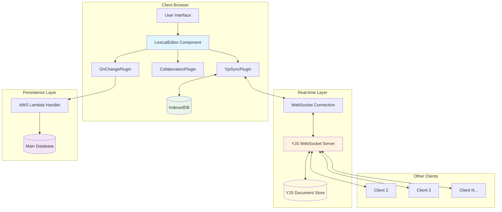
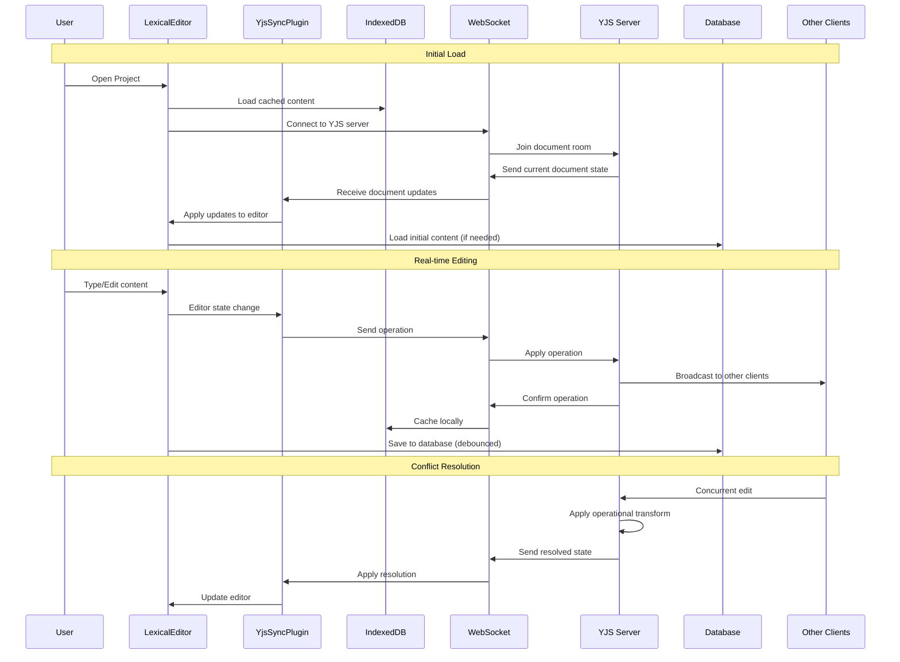
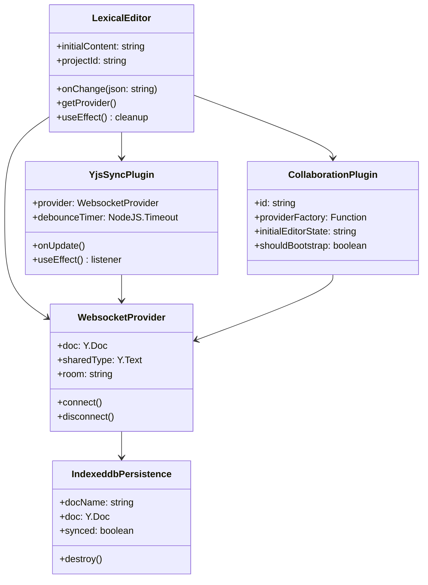
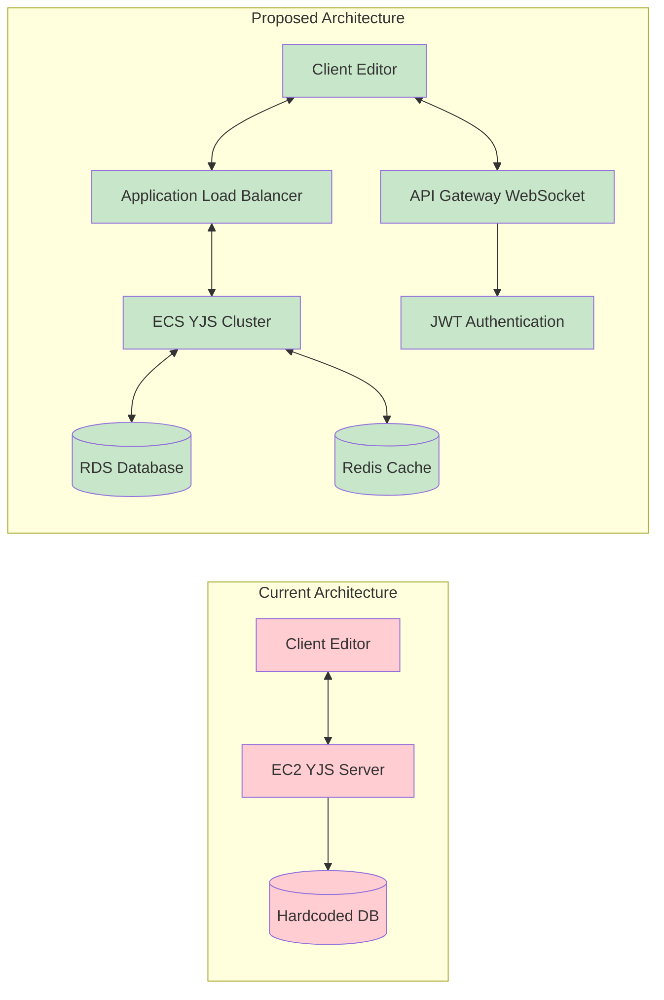

# Lexical Editor Data Flow Diagram

```mermaid
graph TB
    subgraph "Client Browser"
        UI[User Interface]
        LE[LexicalEditor Component]
        YP[YjsSyncPlugin]
        CP[CollaborationPlugin]
        OCP[OnChangePlugin]
        IDB[(IndexedDB)]
        
        UI --> LE
        LE --> CP
        LE --> YP
        LE --> OCP
        YP <--> IDB
    end
    
    subgraph "Real-time Layer"
        WS[WebSocket Connection]
        YJSS[YJS WebSocket Server]
        YJSD[(YJS Document Store)]
        
        YP <--> WS
        WS <--> YJSS
        YJSS <--> YJSD
    end
    
    subgraph "Persistence Layer"
        AWS[AWS Lambda Handler]
        DB[(Main Database)]
        
        OCP --> AWS
        AWS --> DB
    end
    
    subgraph "Other Clients"
        C2[Client 2]
        C3[Client 3]
        CN[Client N...]
    end
    
    YJSS <--> C2
    YJSS <--> C3
    YJSS <--> CN
    
    style LE fill:#e1f5fe
    style YJSS fill:#fff3e0
    style DB fill:#f3e5f5
    style IDB fill:#e8f5e8
    style YJSD fill:#fff8e1
```

## Data Flow Sequence

```mermaid
sequenceDiagram
    participant U as User
    participant LE as LexicalEditor
    participant YP as YjsSyncPlugin
    participant IDB as IndexedDB
    participant WS as WebSocket
    participant YJS as YJS Server
    participant DB as Database
    participant OC as Other Clients

    Note over U,OC: Initial Load
    U->>LE: Open Project
    LE->>IDB: Load cached content
    LE->>WS: Connect to YJS server
    WS->>YJS: Join document room
    YJS->>WS: Send current document state
    WS->>YP: Receive document updates
    YP->>LE: Apply updates to editor
    LE->>DB: Load initial content (if needed)

    Note over U,OC: Real-time Editing
    U->>LE: Type/Edit content
    LE->>YP: Editor state change
    YP->>WS: Send operation
    WS->>YJS: Apply operation
    YJS->>OC: Broadcast to other clients
    YJS->>WS: Confirm operation
    WS->>IDB: Cache locally
    LE->>DB: Save to database (debounced)

    Note over U,OC: Conflict Resolution
    OC->>YJS: Concurrent edit
    YJS->>YJS: Apply operational transform
    YJS->>WS: Send resolved state
    WS->>YP: Apply resolution
    YP->>LE: Update editor
```

## Component Architecture

```mermaid
classDiagram
    class LexicalEditor {
        +onChange(json: string)
        +initialContent: string
        +projectId: string
        +getProvider()
        +useEffect() cleanup
    }
    
    class YjsSyncPlugin {
        +provider: WebsocketProvider
        +debounceTimer: NodeJS.Timeout
        +onUpdate()
        +useEffect() listener
    }
    
    class WebsocketProvider {
        +doc: Y.Doc
        +sharedType: Y.Text
        +room: string
        +connect()
        +disconnect()
    }
    
    class IndexeddbPersistence {
        +docName: string
        +doc: Y.Doc
        +synced: boolean
        +destroy()
    }
    
    class CollaborationPlugin {
        +id: string
        +providerFactory: Function
        +initialEditorState: string
        +shouldBootstrap: boolean
    }
    
    LexicalEditor --> YjsSyncPlugin
    LexicalEditor --> CollaborationPlugin
    LexicalEditor --> WebsocketProvider
    YjsSyncPlugin --> WebsocketProvider
    WebsocketProvider --> IndexeddbPersistence
    CollaborationPlugin --> WebsocketProvider
```

## Current vs Proposed Architecture

```mermaid
graph LR
    subgraph "Current Architecture"
        CE[Client Editor]
        EC2[EC2 YJS Server]
        HDB[(Hardcoded DB)]
        
        CE <--> EC2
        EC2 --> HDB
    end
    
    subgraph "Proposed Architecture"
        PE[Client Editor]
        ALB[Application Load Balancer]
        ECS[ECS YJS Cluster]
        RDS[(RDS Database)]
        REDIS[(Redis Cache)]
        API[API Gateway WebSocket]
        AUTH[JWT Authentication]
        
        PE <--> ALB
        ALB <--> ECS
        ECS <--> RDS
        ECS <--> REDIS
        PE <--> API
        API --> AUTH
    end
    
    style CE fill:#ffcdd2
    style EC2 fill:#ffcdd2
    style HDB fill:#ffcdd2
    style PE fill:#c8e6c9
    style ALB fill:#c8e6c9
    style ECS fill:#c8e6c9
    style RDS fill:#c8e6c9
    style REDIS fill:#c8e6c9
    style API fill:#c8e6c9
    style AUTH fill:#c8e6c9
```